## Overview

  * CMU database course by andy pavlo is a good resource for how the DB engine works internally.
  * This repository is meant to hold notes, code, and diagrams that are implemented/written during studying a course covering postgresSQL.

### Database Design process

  * the first step is to ask what kind of thing we are storing?
  * Then what properties does that thing have?
  * and finally, what type of data does each of those properties contain?

### SQL statement order of execution

  - **FROM**: This is actually the first thing that happens, logically. Before anything else, we’re loading all the rows from all the tables and join them. Before you scream and get mad: Again, this is what happens first logically, not actually. The optimiser will very probably not do this operation first, that would be silly, but access some index based on the WHERE clause. But again, logically, this happens first. Also: all the JOIN clauses are actually part of this FROM clause. JOIN is an operator in relational algebra. Just like + and - are operators in arithmetics. It is not an independent clause, like SELECT or FROM
  - **WHERE**: Once we have loaded all the rows from the tables above, we can now throw them away again using WHERE
  - **GROUP BY**: If you want, you can take the rows that remain after WHERE and put them in groups or buckets, where each group contains the same value for the GROUP BY expression (and all the other rows are put in a list for that group). In Java, you would get something like: Map<String, List<Row>>. If you do specify a GROUP BY clause, then your actual rows contain only the group columns, no longer the remaining columns, which are now in that list. Those columns in the list are only visible to aggregate functions that can operate upon that list. See below.
  - **aggregations**: This is important to understand. No matter where you put your aggregate function syntactically (i.e. in the SELECT clause, or in the ORDER BY clause), this here is the step where aggregate functions are calculated. Right after GROUP BY. (remember: logically. Clever databases may have calculated them before, actually). This explains why you cannot put an aggregate function in the WHERE clause, because its value cannot be accessed yet. The WHERE clause logically happens before the aggregation step. Aggregate functions can access columns that you have put in “this list” for each group, above. After aggregation, “this list” will disappear and no longer be available. If you don’t have a GROUP BY clause, there will just be one big group without any key, containing all the rows.
  - **HAVING**: … but now you can access aggregation function values. For instance, you can check that count(*) > 1 in the HAVING clause. Because HAVING is after GROUP BY (or implies GROUP BY), we can no longer access columns or expressions that were not GROUP BY columns.
  - **WINDOW**: If you’re using the awesome window function feature, this is the step where they’re all calculated. Only now. And the cool thing is, because we have already calculated (logically!) all the aggregate functions, we can nest aggregate functions in window functions. It’s thus perfectly fine to write things like sum(count(*)) OVER () or row_number() OVER (ORDER BY count(*)). Window functions being logically calculated only now also explains why you can put them only in the SELECT or ORDER BY clauses. They’re not available to the WHERE clause, which happened before. Note that PostgreSQL and Sybase SQL Anywhere have an actual WINDOW clause!
  - **SELECT**: Finally. We can now use all the rows that are produced from the above clauses and create new rows / tuples from them using SELECT. We can access all the window functions that we’ve calculated, all the aggregate functions that we’ve calculated, all the grouping columns that we’ve specified, or if we didn’t group/aggregate, we can use all the columns from our FROM clause. Remember: Even if it looks like we’re aggregating stuff inside of SELECT, this has happened long ago, and the sweet sweet count(*) function is nothing more than a reference to the result.
  - **DISTINCT**: Yes! DISTINCT happens after SELECT, even if it is put before your SELECT column list, syntax-wise. But think about it. It makes perfect sense. How else can we remove distinct rows, if we don’t know all the rows (and their columns) yet?
UNION, INTERSECT, EXCEPT: This is a no-brainer. A UNION is an operator that connects two subqueries. Everything we’ve talked about thus far was a subquery. The output of a union is a new query containing the same row types (i.e. same columns) as the first subquery. Usually. Because in wacko Oracle, the penultimate subquery is the right one to define the column name. Oracle database, the syntactic troll ;)
  - **ORDER BY**: It makes total sense to postpone the decision of ordering a result until the end, because all other operations might use hashmaps, internally, so any intermediate order might be lost again. So we can now order the result. Normally, you can access a lot of rows from the ORDER BY clause, including rows (or expressions) that you did not SELECT. But when you specified DISTINCT, before, you can no longer order by rows / expressions that were not selected. Why? Because the ordering would be quite undefined.
  - **OFFSET**: [Don’t use offset](https://blog.jooq.org/2014/08/06/join-the-no-offset-movement/)
  - **LIMIT, FETCH, TOP**: Now, sane databases put the LIMIT (MySQL, PostgreSQL) or FETCH (DB2, Oracle 12c, SQL Server 2012) clause at the very end, syntactically. In the old days, Sybase and SQL Server thought it would be a good idea to have TOP as a keyword in SELECT. As if the correct ordering of SELECT DISTINCT wasn’t already confusing enough.

### SQL relation types: 

  - One-to-many (has many) relationship.
  - Many-to-One relationship.
  - One-to-One relationship.
  - Many-to-Many relationship.

  **Foreign key** deletion constraint:

    * ON DELETE RESTRICT: throw error
    * ON DELETE NO ACTION: throw error
    * ON DELETE CASCADE: delete referenced records as well after deleting the primary record
    * ON DELETE SET NULL: set fk column value to NULL
    * ON DELETE SET DEFAULT: set the fk column to default value if one is provided when creating table

### SQL joins

  * Produces values by merging together rows from different related tables.
  * use a join most times that we are asked to find data that involves multiple resources.

  **Different types of joins**

  

  - **Full Join Type:**

    - Merge tables together, and keep any rows that does not match both tables

  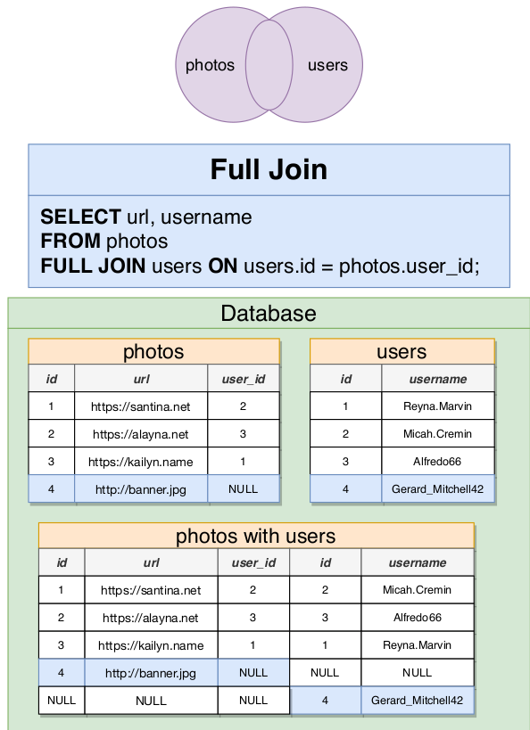

  - **Inner Join Type**:

  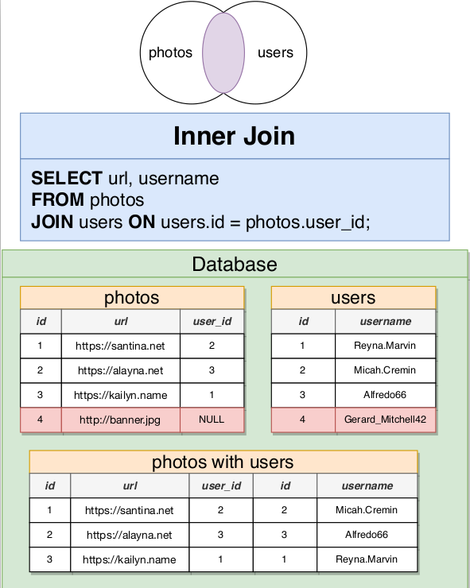

    - merge tables together and drop any records tha don't match in both tables.
    - Like an intersection with sets.

  - **Left Outer Join Type:**

    - Merge tables together, and keep any rows that does not match only in the **source** table.

  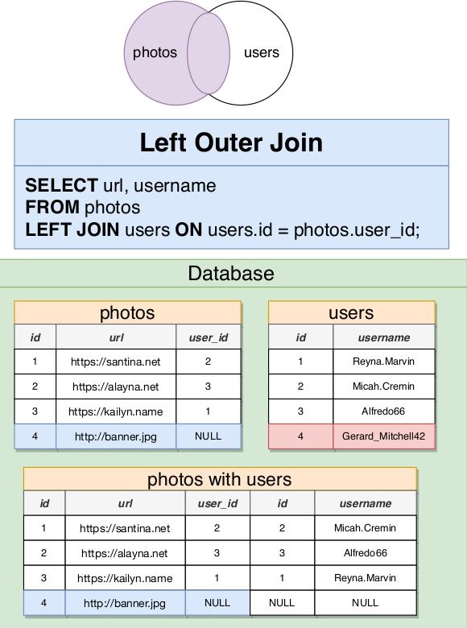

  - **Right Outer Join Type:**
    
    - Merge tables together, and keep any rows that does not match only in the **join** table.

  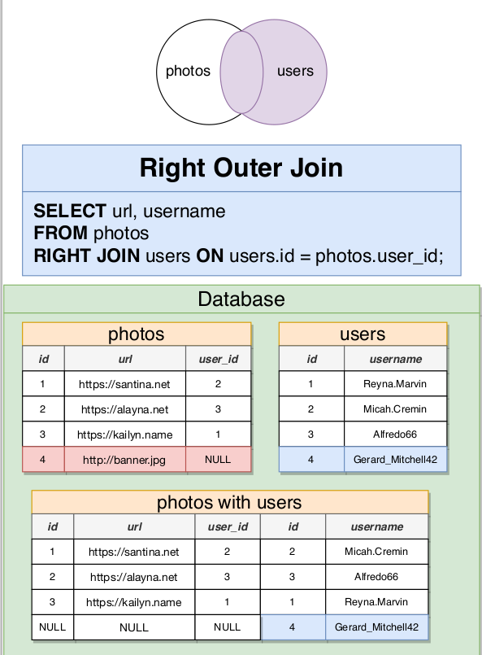


### SQL Aggregations

  * Look at many rows and calculate a single value.
  * Words like `most` `average` are a sign that we need to use an aggregation.

### Notes On sets and sql:
  * When using UNION, the result of the two queries to be unioned, should have the same columns in their results
  * Using UNION ALL allow duplicates between the queries being unioned. 
  * INTERSECT finds the rows common in the results of two queries and removes duplicates
  * INTERSECT ALL finds the rows common in the results of two queries.
  * EXCEPT finds the rows that are present in the first query bot *not* second query (removes duplicates)
  * EXCEPT ALL finds rows that are present in the first query but *not* second query.


### Sub-queries Notes:

  * A sub query could be written in a SELECT, FROM, JOIN, or WHERE clause. This depends on the structure the sub-query returns
  * a sub-query could return a scalar value, many rows and one column, many rows and many columns, and one row and many columns
  * when a sub-query is used in FROM or JOIN clause, it should be always renamed.
  * Validity of sub-queries in WHERE clause depends on the operator and sub-query result structure.
  * A correlated sub-query, is a query that references a value/variable from outer query.
  

### Postgres Data types:

  * These are the main Categories and each category has sub-types:

    - Numbers
    - Currency
    - Binary
    - Date/Time
    - Character
    - JSON
    - Geometric
    - Range
    - Arrays
    - Boolean
    - XML
    - UUID

  **Numbers**:
  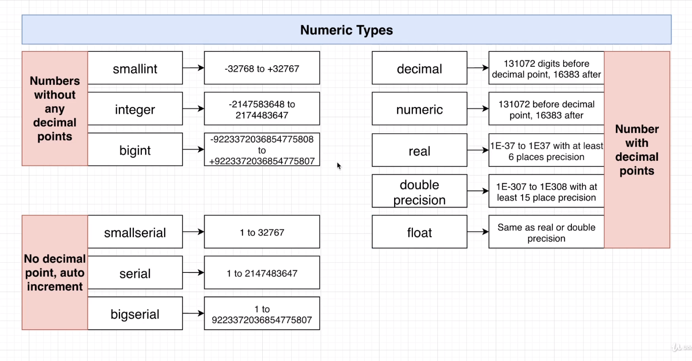

  - for `id` we usually use `serial`.
  - for numbers without decimal point we use `integer`
  - for numbers with high accuracy (like bank accounts and gold grams) we use `numeric`
  - for decimal point number that decimal does not make such a big difference we use `double precision` 
  

  - For floating point math calculations we use `float`, `real`, or `double precision`. These values have inaccuracies in their results but they have better performance when compared to the accurate ones (numeric, decimal)


  **Characters**:
  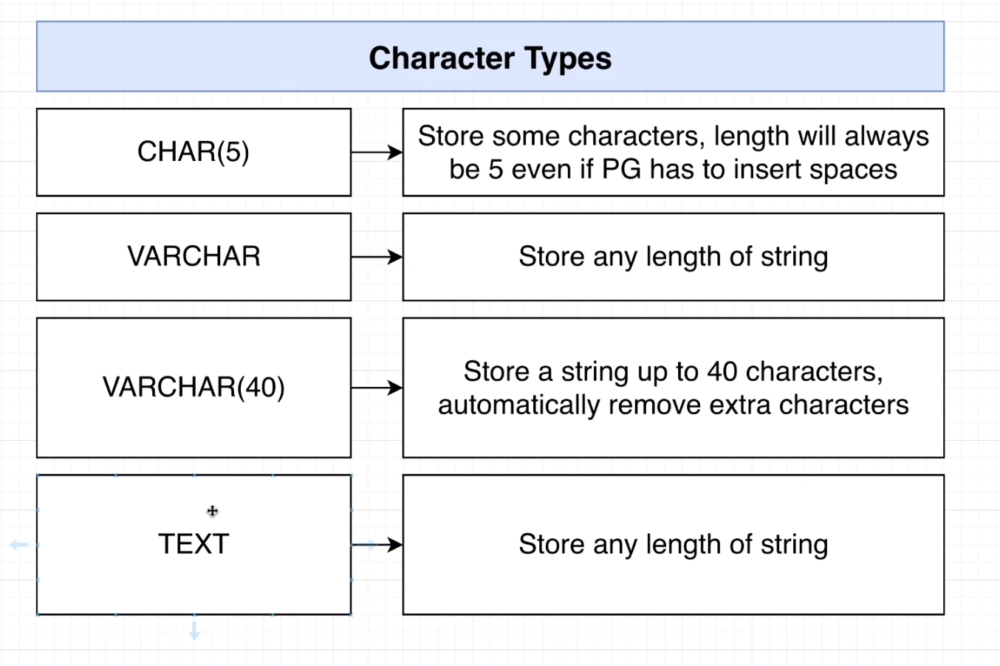

  - There is no difference in terms of performance between these types
  - `char` will truncate string or pad a small string with spaces to be of the exact length specified.


  **Boolean**:
  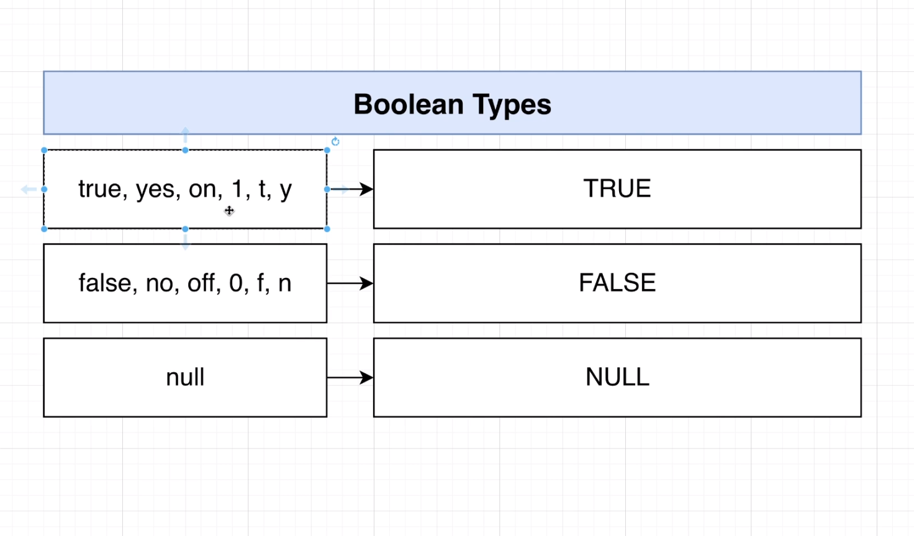

  - Postgres added the `yes` `y` `1` ... as backward compatible solution for older databases

  **Date and Time**:

  - DATE is used to save just the day, month, and year.
  - for TIME, there are two types:

    1. TIME WITHOUT TIME ZONE
    2. TIME WITH TIME ZONE (saved with the UTC offset)

  **INTERVAL**:

  - usually not used as a column type
  - used when we want to do numeric operations on days, hours, and seconds. So we can subtract or add an INTERVAL to a DATE/TIME type, for example:

    `SELECT('NOV-26-1980 1:23 AM EST'::TIMESTAMP WITH TIME ZONE) - ('1 D'::INTERVAL);`

### Validation on the Database side:

  * We add some constraints on each column of our tables (if necessary).
  * One example is `NOT NULL` constraint, that does not allow null value in a specific column.
  * Some other constraint is the DEFAULT constraint.
  * UNIQUE constraint makes sure that a value being inserted is unique across the entire column (there is also multi column uniqueness constraint).
  * a CHECK constraints are made to check if a value is less/greater/equal ...  than a value (we can compare a value to be inserted with a value in another column). 

  **Where to validate**?

  - Most of validation rules are best put on the server, and only the critical ones are on the database side
  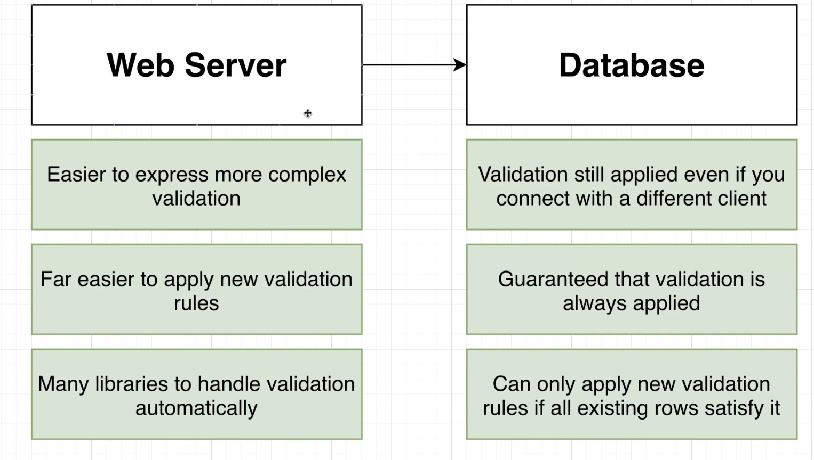

### Building A Like System:

  **The Wrong Way**:

  1. Adding a `likes` column on the resource to be liked (like posts, comments, ...), it has many disadvantages, like we can't know who liked the resource.

  **The right Way**:

  1. design a table called `like` and that holds `user_id` and `post_id` references, also to ensure that a user can only like a post one time, we can apply a UNIQUE constraint on both (user_id, post_id)

  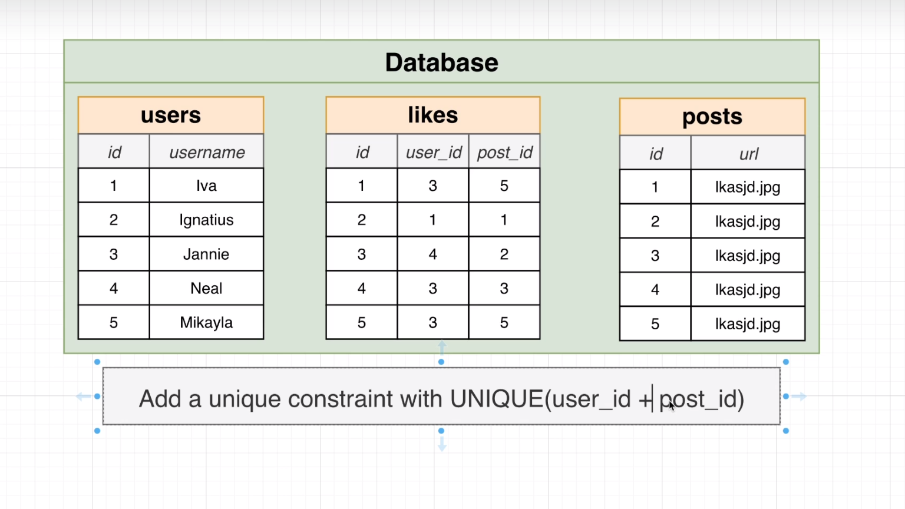
  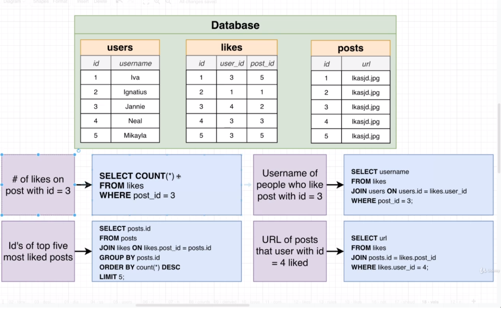

  2. the downside of this approach is that we only can have a single type of reaction, So we can't have a system like facebook.
  3. Also creating a likes table as mentioned we cannot like a comment for instance.
  

  #### To Allow different reactions:

  - we can rename the table to `reactions` instead, and add a column called `type` which is an ENUM that hold the type of the reaction.

  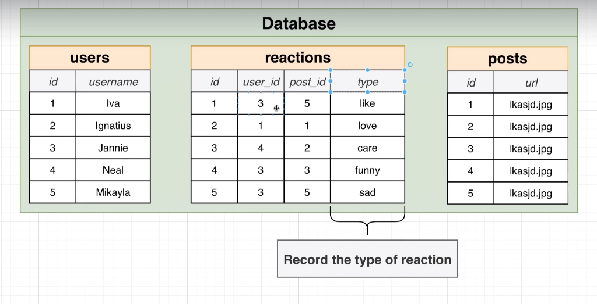

  #### To Allow liking multiple resources

  - First solution is the `polymorphic association`. Of course not using FK constraint is a huge disadvantage. 

  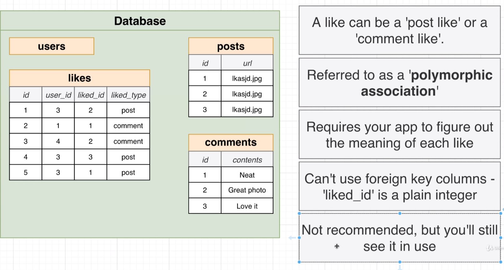

  - Another approach is to have a column (as FK) for each resource to be liked. The issue here is that `likes` table might get too long if we have many resources to like in our system

  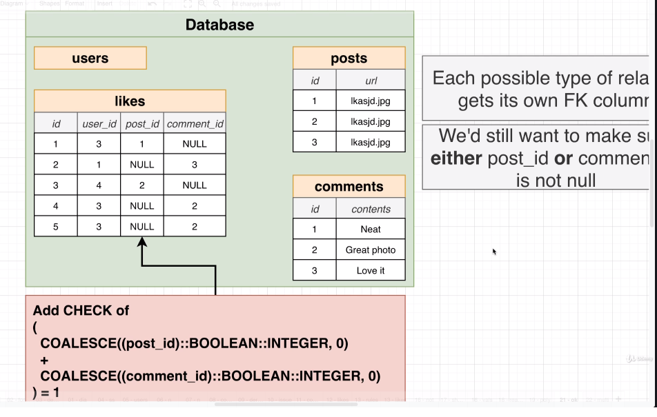

  - The last and simplest solution is to create a table for each resources to be liked, of course a downside is we could end up with many tables.
  - an advantage of this approach is we can have different validation rules per resource.

  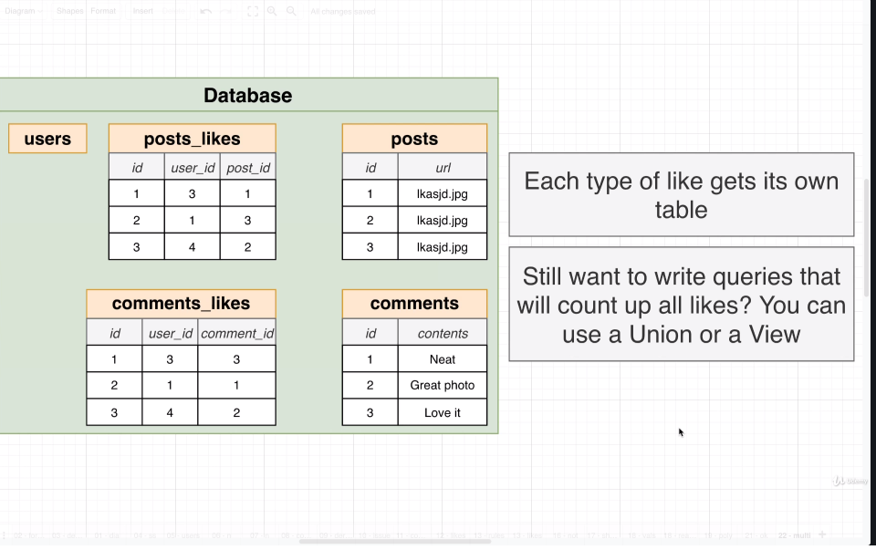

### Building A Mention System:

  * Here we have two kinds of mentions, a mention in post caption, and photo mention AKA tagging.
  * For post location part, we chose to add lat and lng attributes on the posts table, but we could also create a separate table ( this is closely related on how we are going to use location data, as we might run a query in the future to list all posts in a location.)

  * Some considerations when building a tagging system is:
  1. We need to save the location of the tag , if it is related to a photo, like saving an (x, y) distances measured in pixels (this of course assumes all photos are of the same size and shape)
  2. For text mentions, Do we need to list posts a user was mentioned in?
  3. Show list of the most mentioned users?
  4. Notify the users when they're mentioned?

  **Solutions And Designs On DB level:**

  * Generally, there are two solutions for the tagging system, shown in the below 2 diagrams.
  * Solution 1 :

  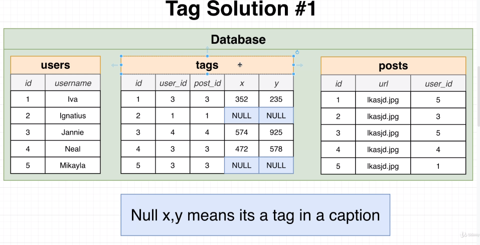

  * Solution 2 :
  
  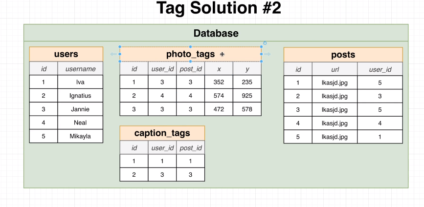

  * Choosing a solution really depends on some questions like the two mentioned in the below diagram, we have to  consider performance, how frequent we query our resources, data access patterns, and whether a functionality might change in the future and how will it be changed.

  * We might allow reacting to photo_tags and not caption_tags, that case shows we might need to separate the two types of tags into two separate tables.

  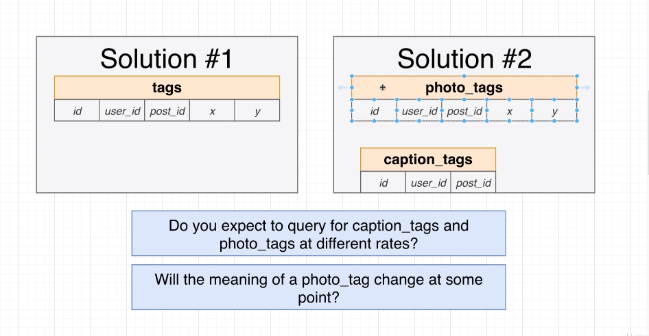

### Building A Hashtag System:

  * As we done previously, we might create a table for each resource that could have a hashtag, for example we could create a table called post_hashtag (id, hashtag_name, post_id), and another one for user's bio, and another one for comments.

  * But we have to think it through, do we really need all these tables, Well, this depends only what will support in our app, like in instagram, we could use hashtags inside posts, comments and bio, but we could only search for hashtags used in posts.

  * So we might only need to save hashtags that are related to posts. So we might not need to model all other resources that use a hashtag.

  * One solution to build a posts_hashtags relation is to use a table like the one shown in the below diagram.

  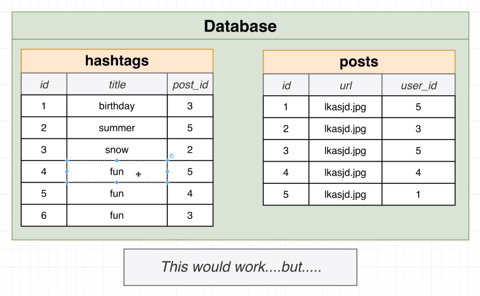

  * But for performance concerns, it is not wise to store many repetitive strings, and a better solution is to have some kind of a table that serves as a set of hashtags inside our application. Like shown below.

  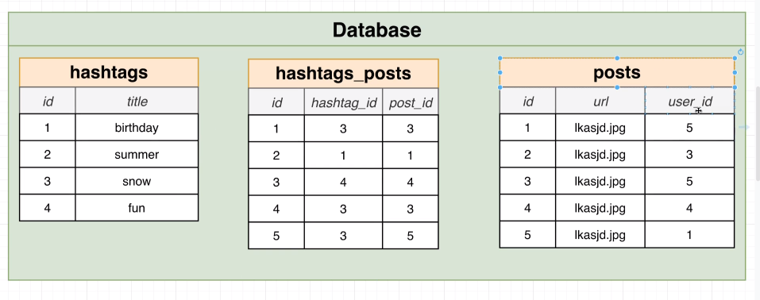

### Designing Follower System:

  * We will implement a pretty simple follower system, a leader is the person being followed, and a follower is the person clicking the follow button.
  * a simple design might look like this:

  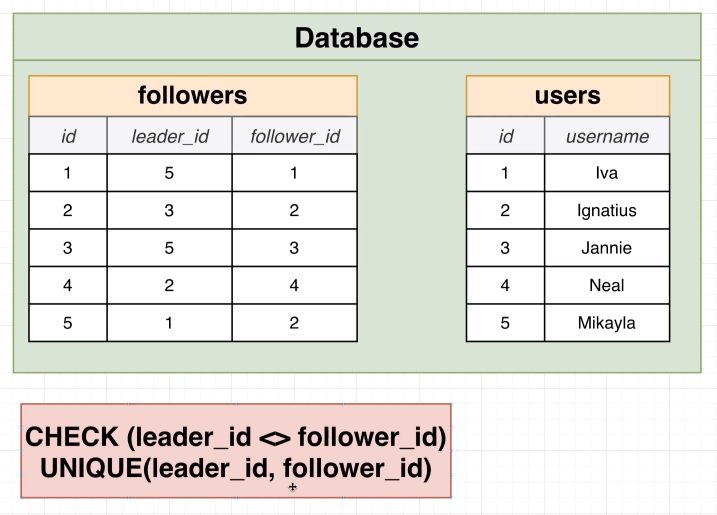

### Performance and Internals of Postgres:

  * Postgres stores data on a folder in our hard drive. Each database is stored in a folder.
  * If we open a folder that corresponds to a database, we'll find a list of files, each file represent an object inside our database.
  * Objects may be tables, indexes, primary keys, ...

  **Definitions**

  * Heap / Heap File: File that contains all the data (rows) of our table.
  * Tuple / Item    : Individual row from the table.
  * Block / Page    : The heap file is divided into many different 'blocks' or 'pages'. Each page/block stores some number of rows. 

  * A page or a block has a fixed size of 8 KB (in case of postgres).
  * Illustration of a block:

  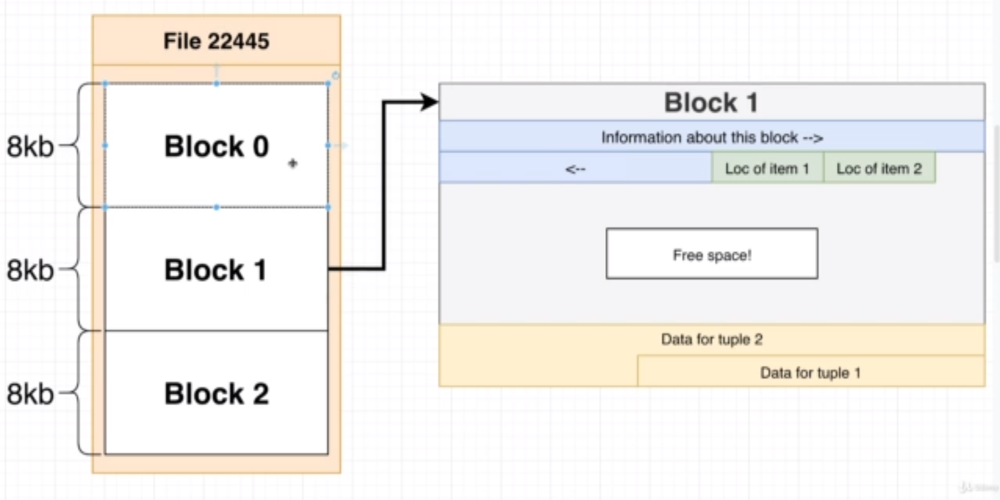

### Indexes:

  * If we're trying to find a user with a certain username, without indexes, we would end up loading all users from heap file into memory, and then scanning them one by one, which is a big performance hit (not always a poor performance).

  * An index is a way not to load all heap file pages into memory. An index is a data structure that tell us where a particular row/record  is stored in a heap file (on which block/page).

  **How Index Works?**

  1. Specify the column we ant to make fast lookups on it.
  2. DB engine extracts only the property we created the index on along with in which block and at what index it existed.
  3. Sort these extracted data in a meaningful way (by value for number, alphabetically for strings ...)
  4. Organize these sorted data into a B-Tree data structure (B+)

  5. When we want to find a particular record, we use the index and it tells us exactly where to find that record, and by loading only onr page in memory and going directly to an exact index we find our record.

  **Downsides Of Indexes**:

  * Each Index consumes a storage on the hard disk, so creating a lot of indexes for a large database, we could end up paying extra money if we're using a hosted DB solution.

  * Slows insert/update/delete operations, because indexes needs to be updated.
    (Updating might change the Tuple boundaries in the page, causing an update for the its and other items offset in the page which reflects to an update in the index DS)
  * An index might be not used at the end by the BD engine.

  **Indexes Types**

  * The first one is B-Tree index (which is almost what we'll use most of the time).
  * Hash    : Speeds up simple equality checks.
  * GiST    : Geometry and full-text search data.
  * SP-GiST : Clustered Data, such as dates - many rows might have the same year.
  * GIN     : For columns that contain JSON data or Arrays.
  * BRIN    : Specialized for really large datasets.

  **Automatically Created Indexes**

  * primary key and unique indexes are created automatically for us.

  **Index on Disk**:

  * An index is essentially a file on disk consisting of pages (8KB pages) but with a distinction that pages could be leaf Page, Root page or a meta page.

  * the page layout in indexes are the same as page layout in case of regular table pages. page has header, item location, free space, tuple or data itself.

### Query Pipeline In Postgres:

  * The first thing is the **parser**: which takes the query and tries to make sense what the query is all about and validate the spelling, punctuation, and at last build the *query tree*.
  * The **rewriter** is the second step: in which this piece of code takes the query code and make some modification to it and decompose views into underlying table references.
  * The **planner** is the big step we care about, it takes query tree and come up with plans to retrieve what information we're trying to fetch. Maybe use an index or do a full scan or whatever plan it comes up with and choose the most appropriate solution.
  * The fourth step is to run or **execute** the query.

  **Planner**:

  * We use EXPLAIN, and EXPLAIN ANALYZE to benchmark the query and performance analysis.
  * EXPLAIN will only build the plan and show it, but EXPLAIN ANALYZE will build the plan and execute the query.

  * Example on the result of EXPLAIN ANALYZE SQL query:

  ``` sql

    EXPLAIN ANALYZE SELECT username, contents
    FROM users
    JOIN comments on comments.user_id = users.id
    WHERE users.username = 'Alyson14';
  ```

  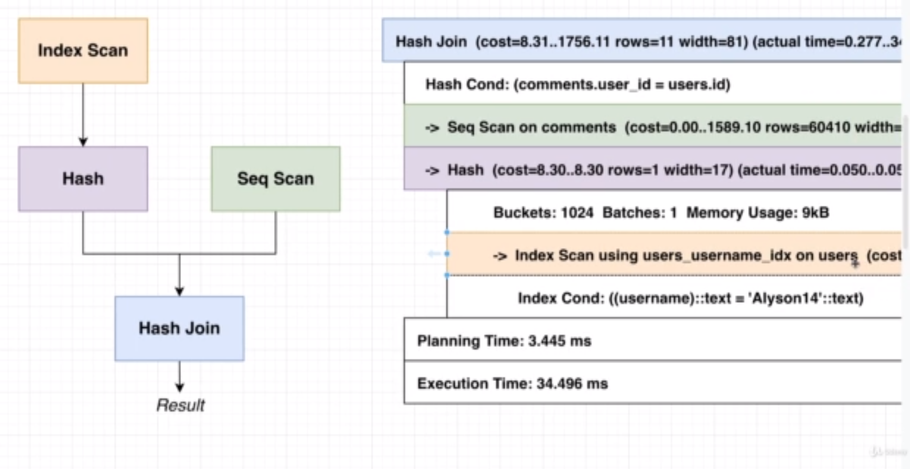

  * The first and all boxes with `->` at the beginning mean it's a query node where we do actual processing.
  * We read the above result from inside out, so the first step is `Index Scan` then the result is passed up to `Hash` and alongside the `Hash` there is also `Seq Scan` of the comments table and its result is passed to the First node `Hash Join` and combine the two results into one result.

  * Further investigation on the numbers and fields with each node:

  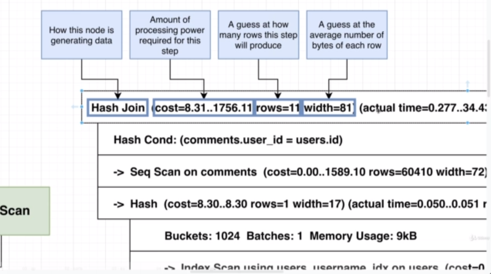

  * For calculating the `Cost` field, we will consider a more simple query as an example:

  ``` sql

    SELECT username
    FROM users
    WHERE users.username = 'Alyson14';
  ```

  * The planner will probably have two solutions to find that user, namely these two:

  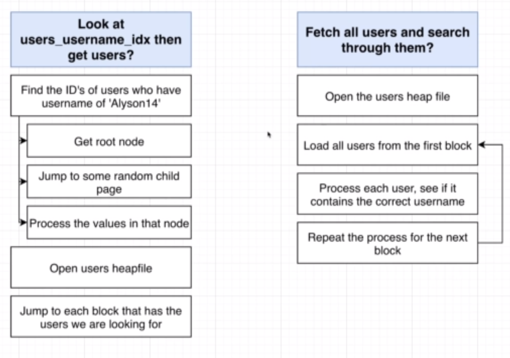

  * We need some score to determine which method has better performance, so we could say that the number of pages loaded is a good metric here, so have this comparison now:

  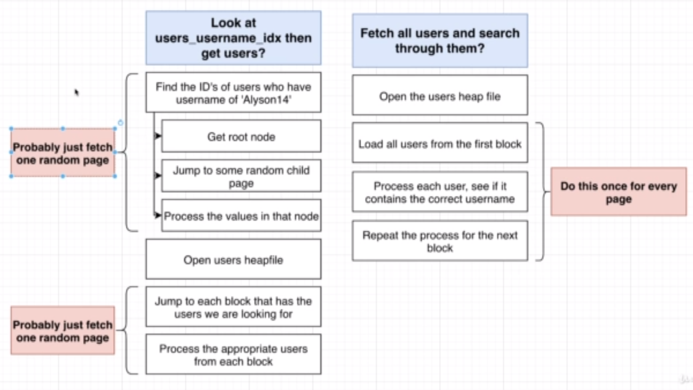

  * But beware that reading sequential pages from disk is much more convenient than reading random pages at random locations.

  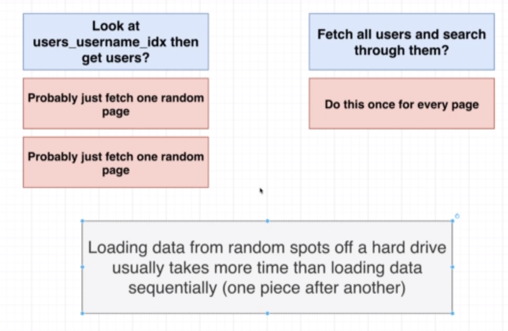

  * So if we assigned a penalty factor of `4` (completely random number here!!!) for every random page read
    we would end up with (2 random reads * 4 penalty factor = 8) vs (110 users table pages * 1 base factor seq read = 110)
    and probably choose the index method.

  * To calculate the cost (predicted cost with a score)  for an operation in postgres, the planner uses this equation:

  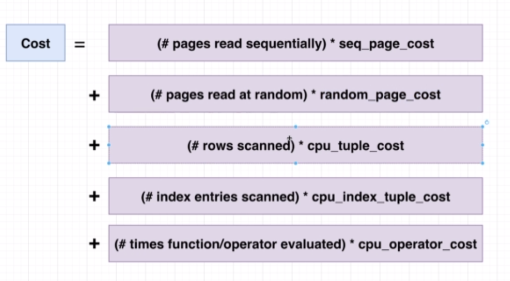

  * A very important example that shows that a sequential scan could be more convenient than an index, is when we are fetching the majority of records out of a table using a WHERE clause on an indexed column, e.g, Find all likes created at dates greater than 2013-10-10, in our instagram database, would result in 80% of the likes, so using an index would mean having a lot of random pages accessed, and that means a larger cost if index used compared to sequential scan.

### Common Table Expressions:

  * It is a technique that makes queries more easy to read.

  

  * to solve the above problem with CTE, we would use a query like shown below:

  

  * Another usage of CTEs is recursive CTE which is very handy tool used for complex queries.

### Recursive Common Table Expressions:

  * It is most commonly used with Graphs/Trees data structures.
  * It is going to have UNION keyword almost all the time.

  ``` sql
    WITH RECURSIVE countdown(val) AS (

      SELECT 3 AS val -- initial condition / non-recursive query
      UNION
      SELECT val - 1 FROM countdown WHERE val > 1 -- recursive query
    )

    -- Usage
    SELECT * FROM countdown;
  ```

  * Behind the scenes, RCTE creates two tables, namely, the Results and Working tables. And the columns of these tables are whatever we wrote in the parentheses of the RCTE, in our case one column called `val`. below is a picture of the steps used to calculate RCTE.

  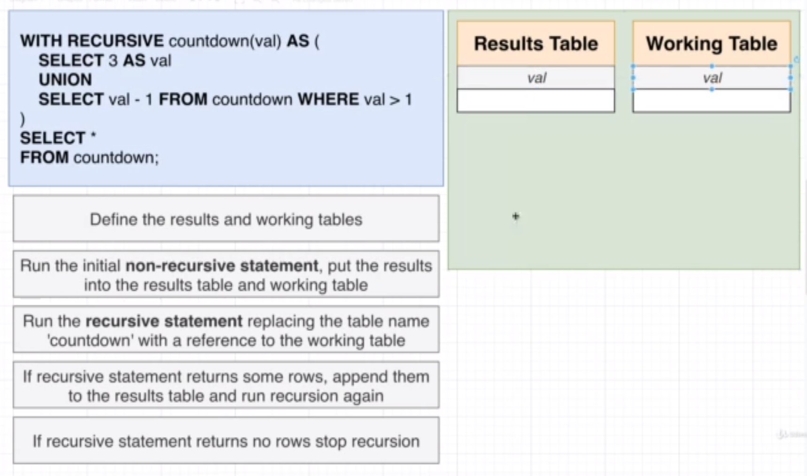

  **RCTE Example using instagram DB**:

  * here is a screenshot from instagram, that suggests people to me to follow.

  

  * Instagram makes the following assumption: Since I am following X person, then I might be interested in following whoever that X is following, something like this:

  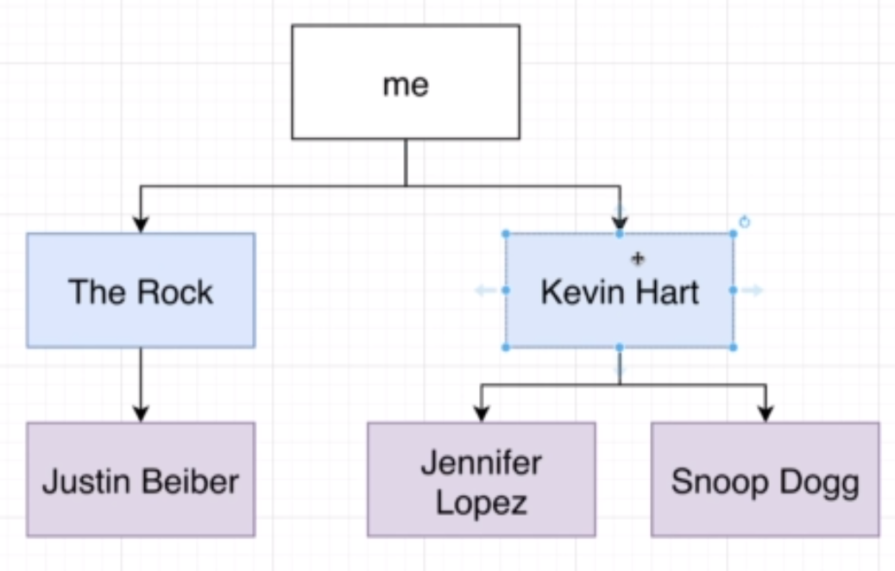

  * But what if I continue scrolling down the ap and I am not interested in any of the suggestion, than instagram would go one extra level in the followers **Graph**, like this:

  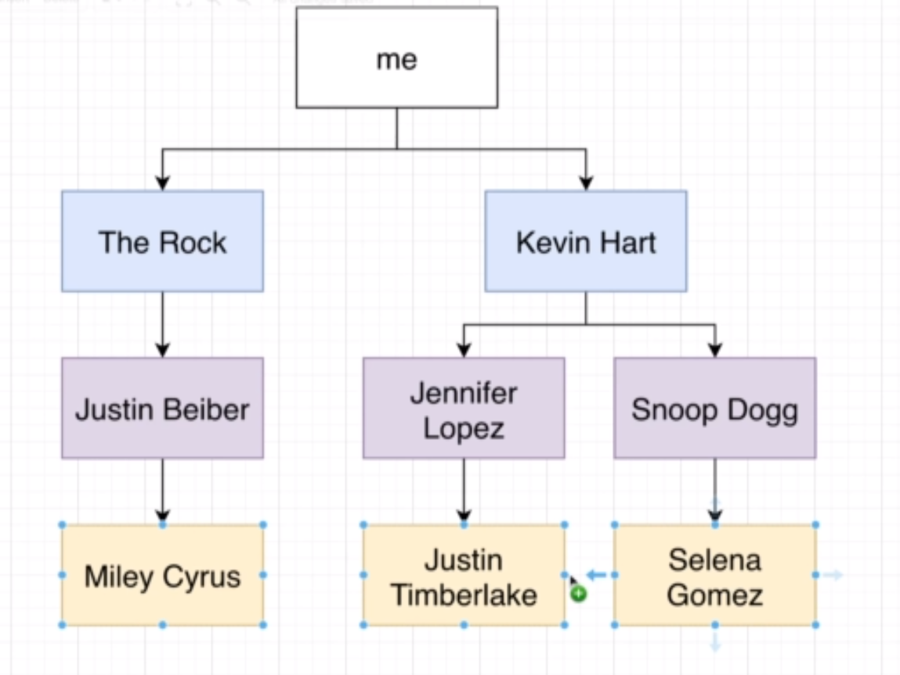

  **The Query to Build such a tree**:

  * We are trying to make suggestion to Hallie (userId = 1) on who to follow.

  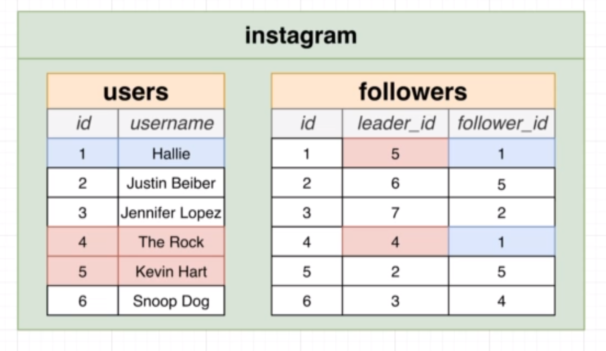

  * We can see that hallie is following `the rock` and `kevin hart`, and these two users are following `justin beiber`, `jennifer lopez`, and `Snoop Dog`.

  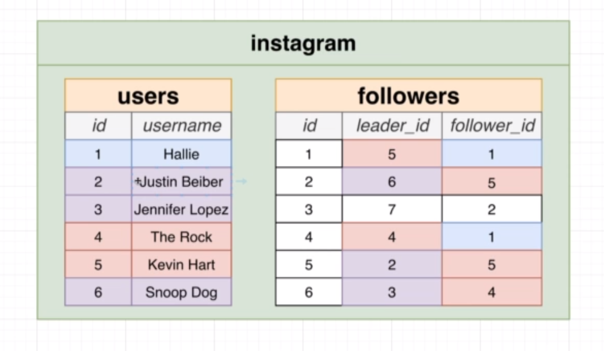

  * to get this result, we could write a query like this:

  ```sql
    WITH RECURSIVE suggestions(leader_id, follower_id, depth) AS ( -- depth is a column we created to calculate what depth we are at in the suggestion tree

      SELECT leader_id, follower_id, 1 AS depth
      FROM followers
      WHERE follower_id = 1 -- We're finding suggestion for user with ID 1

    UNION

      SELECT followers.leader_id, followers.follower_id, depth + 1
      FROM followers
      JOIN suggestions ON suggestions.leader_id = followers.follower_id
      WHERE depth < 3

    )

    -- Usage
    SELECT DISTINCT users.id, users.username
    FROM suggestions
    JOIN users ON users.id = suggestion.leader_id
    WHERE depth > 1
    LIMIT 30;
  ```

  *Explanation is in v214*

  * RCTEs are good to find all employees managed by one person, or find all states and municipalities in a country, or any time we are working with hierarchy.

### Using Views:

  * An example to use view is to find the most popular users in our database, and this is determined by users that are tagged the most.
  * A solution might be:
    1. union photo_tags and post_tags tables, then join users table with this union-ed table.
    2. Group the result by username, and count the groups.
    3. Sort the groups, and Voila, we got our users sorted by popularity.

  ```sql

    SELECT username, COUNT(*)
    FROM users
    JOIN (
      SELECT user_id FROM photo_tags
      UNION ALL
      SELECT user_id FROM caption_tags
    ) AS tags ON tags.user_id = users.id
    GROUP BY username
    ORDER BY COUNT(*) DESC

  ```
  * As you can see we have been defining union operation on photo_tags and caption_tags tables
  * This could be an indication that we made a bad database design. And to fix this we have two possible solutions:
    1. Merge two tables into one table, and delete the original tables

  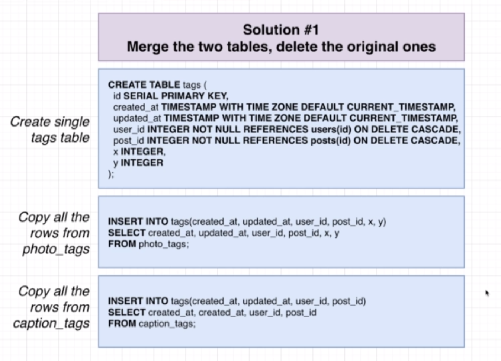

    - This has some serious drawbacks, we can't copy over the ID's of photo_tags and caption_tags since they must be unique, and if we delete original tables we break any existing queries that refer to them.

    2. Creating A view

  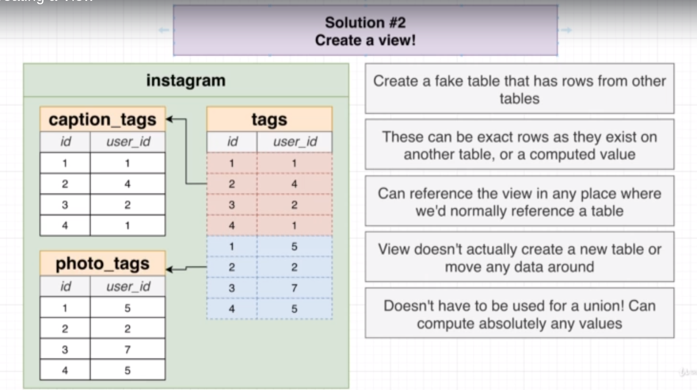

  ``` sql
    CREATE VIEW tags AS (
      SELECT id, created_at, user_id, post_id, 'photo_tag' AS type FROM photo_tags
      UNION ALL
      SELECT id, created_at, user_id, post_id, 'caption_yag' AS type FROM caption_tags
    );
  ```

  * But when to use a view, here is a list of some scenarios where we might need to create a view:
  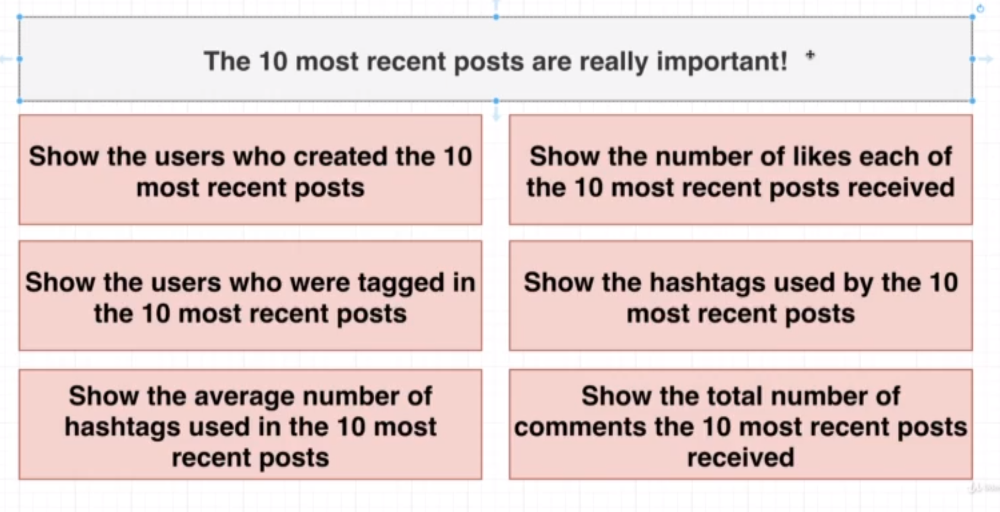

  ```sql
  -- Most Recent 10 Posts

  CREATE VIEW recent_posts AS (
    SELECT* 
    FROM posts
    ORDER BY created_at DESC
    LIMIT 10
  );
  ```
  * If we need to change/update a view, we could use `CREATE OR REPLACE VIEW` keyword.
  * And to delete a view we use `DROP VIEW view_name`.

### Materialized View

  * A variation of a view, that differs from it in some aspects like:

    - A materialized view could be executed at very specific times, and the results are saved and can be referenced without re-running the query again.

  * Materialized views are used with very expensive queries. 

  * Example:

  ` For Each Week, show the number of likes posts, and comments have gotten. Use the created_at of the posts and comments as boundaries to weeks`.

  - Solution 1: Three-way Left Join:

  

  ```sql
  SELECT 
    date_trunc('week', COALESCE(posts.created_at, comments.created_at)) AS week,
    COUNT(posts.id) AS posts_likes,
    COUNT(comments.id) AS comments_likes
  FROM likes
  LEFT JOIN posts ON posts.id = likes.post_id
  LEFT JOIN comments ON comments.id = likes.comment_id;
  ORDER BY week;
  GROUP BY week;
  ```

  * the above query takes a lot of time to be executed, and we should use materialized view to enhance enhance performance.
  * The materialized view will wrap an expensive query like the above, and execute it only at a specific time.

  ```sql
  CREATE MATERIALIZED VIEW weekly_likes AS (

    -- some expensive query here

  ) WITH DATA; -- Means run this query the first time this view is created
  ```

  * One downside is that cached data does not get automatically updated if any of the records used inside the view is updated, and we need to update it manually using `REFRESH MATERIALIZED VIEW view_name;`